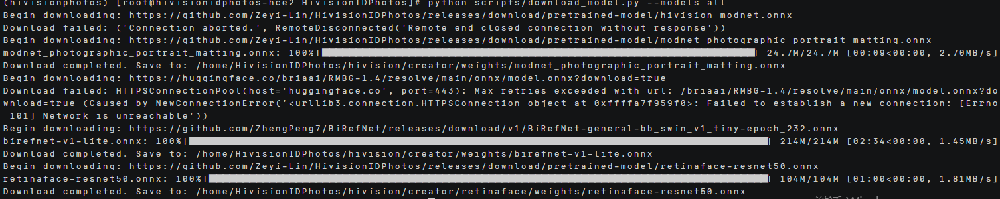
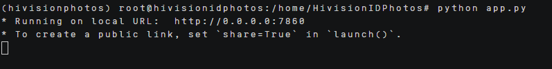
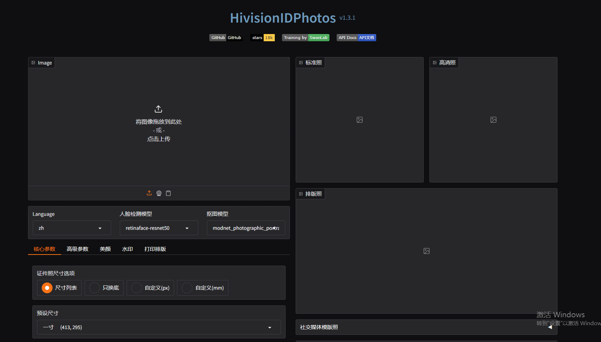
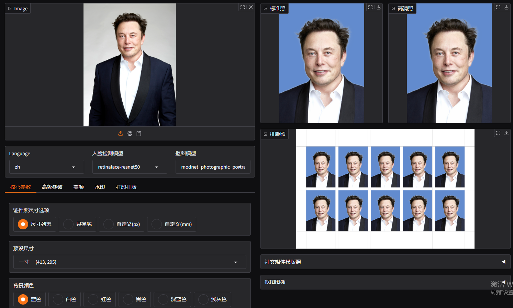

# HivisionIDPhotos部署指南


## ‌一、环境准备


### 更新系统


#### EulerOS2.0


```
yum -y update  
yum -y upgrade
```


#### Ubuntu 24.04


```
apt-get -y update
export DEBIAN_FRONTEND=noninteractive
apt-get -y -o Dpkg::Options::="--force-confold" dist-upgrade
```


## **二、安装conda**


```
mkdir -p ~/miniconda3

wget https://repo.anaconda.com/miniconda/Miniconda3-latest-Linux-aarch64.sh -O ~/miniconda3/miniconda.sh

bash ~/miniconda3/miniconda.sh -b -u -p ~/miniconda3

rm -f ~/miniconda3/miniconda.sh

source ~/miniconda3/bin/activate

conda init --all
```


创建虚拟环境

```
conda create -n hivisionphotos python=3.10
```

## **三、源码下载**

### **1.下载hivisionIDphotos的源码**

```
 git clone https://github.com/Zeyi-Lin/HivisionIDPhotos.git

pip install -r requirements.txt -i https://pypi.tuna.tsinghua.edu.cn/simple

pip install -r requirements-app.txt -i https://pypi.tuna.tsinghua.edu.cn/simple

sudo yum install mesa-libGL -y
```


### **2.下载人像抠图模型权重文件**

```
python scripts/download_model.py --models all 下载所有的权重文件
```



下载的模型权重有MODNet官方权重、hivision_modnet（纯色换底抠图模型）、rmbg-1.4（[BRIA AI](https://huggingface.co/briaai/RMBG-1.4)开源的抠图模型）和birefnet-v1-lite（拥有最好的分割精度)

## **四、启动项目**

### **1.推理**

基础推理运行代码为：

python app.py

运行之后会显示如下结果：



然后使用公网ip+7860打开网页进行使用



之后就能选择参数进行使用，能够上传图片、摄像头获取等。还能够选择人脸检测模型和抠图模型，证件照制作选择（指定尺寸、国家公务员考试等)。设置好自己需要的参数之后，点击开始制作就能够获得结果。

 

从结果可以看出，制作的结果图有标准照、高清照和排版照等。 
